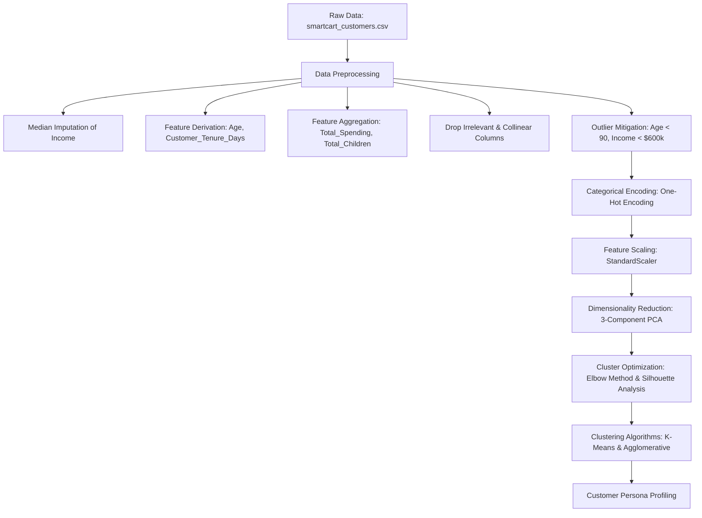

# 🛒 SmartCart: E-Commerce Customer Segmentation System
[](https://www.python.org/)
[](https://scikit-learn.org/)
[](https://pandas.pydata.org/)
[](https://jupyter.org/)
[](#)

An end-to-end unsupervised machine learning pipeline designed to perform customer segmentation for e-commerce campaigns. By leveraging **Principal Component Analysis (PCA)**, **K-Means**, and **Hierarchical Agglomerative Clustering**, this system transforms raw transactional and demographic customer data into actionable marketing personas.

---

## 💼 Business Case & Impact
In modern e-commerce, generic "one-size-fits-all" marketing campaigns suffer from high customer acquisition costs (CAC) and low conversion rates. This project solves that by automatically grouping customers based on their purchasing behavior, demographics, and engagement patterns. 

**Key Business Outcomes:**
*   **Targeted Campaigns:** Tailor promotions to specific personas (e.g., discount hunters vs. luxury shoppers).
*   **Optimized Spend:** Focus high-touch campaigns on premium segments while utilizing automated, low-cost marketing for low-value segments.
*   **Churn Mitigation:** Identify disengaged segments (low recency, high complaints) early and execute re-engagement strategies.

---

## 🛠️ Machine Learning Pipeline & Architecture

The clustering system processes raw customer data through a structured data science pipeline:



### 1. Data Preprocessing & Feature Engineering
*   **Imputation**: Replaced missing `Income` values with the column median to preserve distribution stability.
*   **Temporal Features**: Converted joining dates into `Customer_Tenure_Days` using the maximum database date as a baseline, and calculated `Age` relative to the present year (2026).
*   **Feature Synthesis**:
    *   `Total_Spending` = Sum of wine, fruit, meat, fish, sweet, and gold product purchases.
    *   `Total_Children` = Sum of kids (`Kidhome`) and teenagers (`Teenhome`) in the household.
*   **Dimensionality Cleaning**: Dropped `ID`, `Year_Birth`, original marital status, children counts, and redundant spending columns.

### 2. Outlier Removal
Outliers can severely distort distance-based clustering algorithms (like K-Means). We filter extreme values:
*   Removed records where `Age >= 90` years.
*   Removed records where `Income >= $600,000`.
*   *Impact*: Cleaned the dataset from **2,240** records to **2,236** highly representative customer entries.

### 3. Scaling & Dimensionality Reduction (PCA)
*   **Standardization**: Transformed features to a mean of 0 and variance of 1 using `StandardScaler` to ensure distance metrics treat all features equally.
*   **Principal Component Analysis (PCA)**: Reduced the high-dimensional feature space to **3 principal components**, minimizing multicollinearity and simplifying the clustering boundary space while capturing critical variance.

---

## 📊 Performance & Optimization Metrics

### 1. Principal Component Analysis (PCA) Variance
The 3 principal components extract the core dimensions of customer behavior:
*   **PC1 Variance Explained:** `23.16%`
*   **PC2 Variance Explained:** `11.39%`
*   **PC3 Variance Explained:** `10.41%`
*   **Total Explained Variance:** **`44.96%`** of the information is retained in just 3 dimensions.

### 2. Finding the Optimal Clusters ($K$)
To identify the most robust number of clusters, both the **Elbow Method (WCSS)** and **Silhouette Analysis** were evaluated across $K \in [1, 10]$:

| Number of Clusters ($K$) | WCSS (Within-Cluster Sum of Squares) | Silhouette Score |
|:---:|:---:|:---:|
| 1 | 18093.26 | *N/A* |
| 2 | 10760.84 | 0.3716 |
| 3 | 8830.29 | 0.3077 |
| **4 (Optimal)** | **6650.97** | **0.3581** |
| 5 | 5006.16 | 0.4000 |
| 6 | 4396.31 | 0.3993 |
| 7 | 3857.63 | 0.4026 |
| 8 | 3207.06 | 0.4051 |
| 9 | 3025.22 | 0.4012 |
| 10 | 2651.44 | 0.4029 |

*   **Elbow Analysis**: Utilizing the `KneeLocator` algorithm, the mathematical "elbow" point is identified at **`K = 4`**, where the rate of decrease in WCSS slows significantly.
*   **Silhouette Selection**: Although higher cluster counts ($K \ge 5$) display slightly higher silhouette scores, $K=4$ was selected to prioritize segment interpretability and avoid over-segmentation.

---

## 👥 Customer Personas & Actionable Marketing Strategies

Following **Hierarchical Agglomerative Clustering** with a `ward` linkage criteria on the 3D PCA space, four distinct customer segments were identified. Below are their centroid profiles and recommended business interventions:

### 1. Cluster Summaries (Centroid Means)
| Metric | Cluster 0: Partnered / Mid-Income | Cluster 1: Partnered / High-Income | Cluster 2: Single / Low-Income | Cluster 3: Single / High-Income |
|:---|:---:|:---:|:---:|:---:|
| **Percentage of Customers** | 40.7% | 23.9% | 19.9% | 15.5% |
| **Average Income** | $39,681 | **$72,808** | $36,960 | **$70,722** |
| **Average Age** | 55.7 years | 59.5 years | 55.7 years | 58.9 years |
| **Total Children** | 1.24 | 0.51 | 1.27 | 0.46 |
| **Total Spending** | $221.96 | **$1,236.59** | $165.70 | **$1,190.39** |
| **Recency (Days since last purchase)** | 48.9 days | 49.2 days | 48.3 days | 50.5 days |
| **Web Visits / Month** | 6.3 | 3.6 | 6.7 | 3.7 |
| **Household Structure** | 100% Partnered | 100% Partnered | 99.3% Single | 100% Single |

---

### 2. Marketing Strategy Playbook

```carousel
#### 👨‍👩‍👧‍👦 Cluster 0: Partnered / Mid-Income (Low Spending)
*   **Characteristics**: Married/cohabiting with children, moderate household income, frequent web visitors but low conversion rates.
*   **Actionable Strategy**: Run family-oriented bundle promotions, deal purchases, and back-to-school discount campaigns. Emphasize value-for-money in digital ads.
<!-- slide -->
#### 💎 Cluster 1: Partnered / High-Income (Premium Buyers)
*   **Characteristics**: Coupled households with few or no children at home. Highest average income and highest overall spending. High catalog/store purchasing.
*   **Actionable Strategy**: Enroll in high-tier VIP loyalty programs. Market premium wines and gold products. Offer concierge services and exclusive previews.
<!-- slide -->
#### 🙋‍♂️ Cluster 2: Single / Low-Income (Budget Shoppers)
*   **Characteristics**: Single-parent households or individuals with children. Lowest income and lowest spending. High web visits but lowest purchase rates.
*   **Actionable Strategy**: Implement retargeting ads highlighting budget-friendly deals. Offer flexible payment options (e.g., BNPL) and free shipping thresholds.
<!-- slide -->
#### 🕶️ Cluster 3: Single / High-Income (Afluent Singles)
*   **Characteristics**: Single individuals with high disposable income, few/no kids, high spending, and strong response to campaign promotions.
*   **Actionable Strategy**: Deliver individualized product recommendations (e.g., electronics, boutique items) via targeted mobile/email channels. Leverage high response rates with flash sales.
```

---

## 📈 Technical Recommendations to Increase Performance

To further improve model quality, inference speed, and scalability, the following paths are recommended:

### 1. Algorithm & Machine Learning Enhancements
*   **Alternative Clustering Algorithms**:
    *   **DBSCAN / HDBSCAN**: Useful for detecting clusters of arbitrary shape and automatically isolating outliers as noise, removing the need for ad-hoc outlier thresholds.
    *   **Gaussian Mixture Models (GMM)**: Applies "soft clustering" where customers have a probability of belonging to each cluster (useful for hybrid shopping habits).
*   **Advanced Dimensionality Reduction**:
    *   Replace linear PCA with **UMAP** (Uniform Manifold Approximation and Projection) or **t-SNE** to preserve non-linear relationships and local cluster structures, yielding clearer visual separations.
*   **Deep Feature Engineering**:
    *   Integrate **RFM (Recency, Frequency, Monetary)** variables with custom ratios, such as `Spending-to-Income Ratio` or `Deal-to-Web Purchases Ratio` to expose shopping efficiency.

### 2. Computational & System Architecture Improvements
*   **Vectorization**: Replace remaining iterative data manipulation loops with optimized vectorized Pandas/NumPy operations.
*   **Memory Footprint Reduction**: Downcast numeric fields (e.g., converting `float64` to `float32` and `int64` to `int32`), reducing RAM requirements for large-scale customer data sets.
*   **Parallel Execution**: Leverage scikit-learn's `n_jobs=-1` parameter for the K-Means distance calculations to distribute the computation across all available CPU cores.
*   **Unified Pipelines**: Implement scikit-learn `Pipeline` and `ColumnTransformer` frameworks to combine imputation, scaling, PCA, and clustering. This prevents data leakage and ensures seamless deployment into production API endpoints.

---

## 🚀 Environment Setup & Execution Guide

Follow these steps to set up the project on your local machine:

### 1. Prerequisites
Ensure you have **Python 3.13** (or 3.10+) installed.

### 2. Installation
Create and activate the virtual environment, then install all project requirements:

```bash
# Clone the repository (or run in root folder)
cd SmartCart_E-Commerce--A_Customer_Segmentation_System

# Create virtual environment
python -m venv .venv

# Activate Virtual Environment
# For Windows PowerShell:
.venv\Scripts\Activate.ps1
# For Windows CMD:
.venv\Scripts\activate.bat
# For macOS/Linux:
source .venv/bin/activate

# Install required dependencies
pip install pandas numpy matplotlib seaborn scikit-learn kneed jupyter
```

### 3. Select Interpreter in VS Code (Optional)
To run the notebook in VS Code using the created virtual environment:
1. Open the workspace folder in VS Code.
2. Open `SmartCart_Clustering_System.ipynb`.
3. Click on the kernel selector in the top-right corner.
4. Select **Python Environments...** and point to the interpreter path:
   ```text
   .venv/Scripts/python.exe
   ```
*(Note: A `.vscode/` directory containing local configurations may be created by VS Code. For clean git commits, you can delete this folder or add it to `.gitignore`).*

### 4. Running the Project
To run the notebook from the terminal and save the executed notebook outputs in-place:
```bash
jupyter nbconvert --to notebook --execute --inplace SmartCart_Clustering_System.ipynb
```
Or launch Jupyter Notebook to inspect the plots interactively:
```bash
jupyter notebook
```