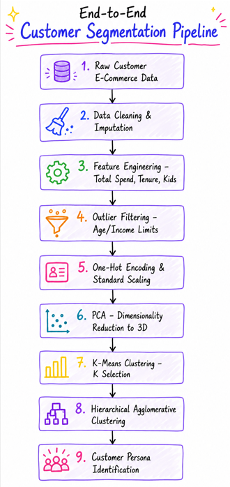
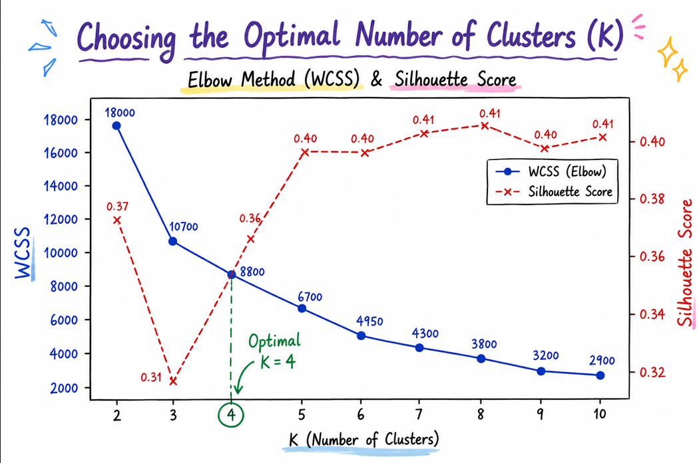
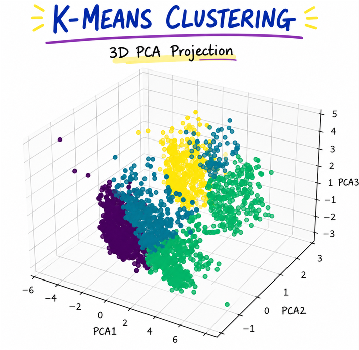
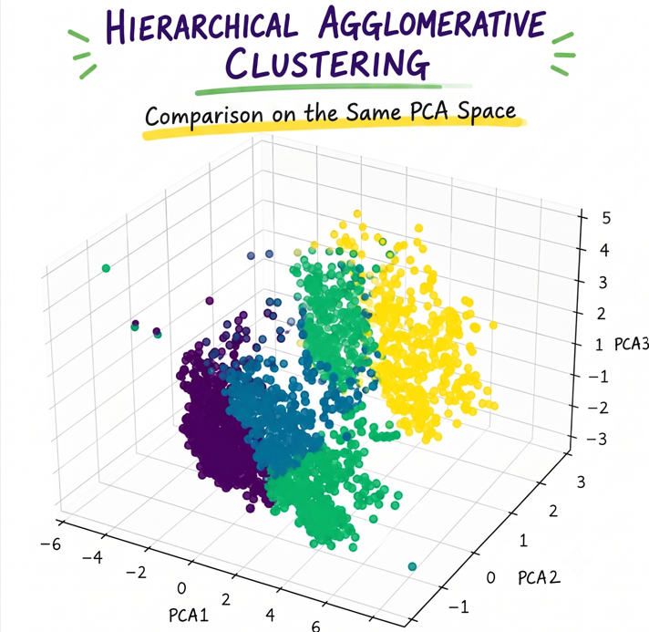
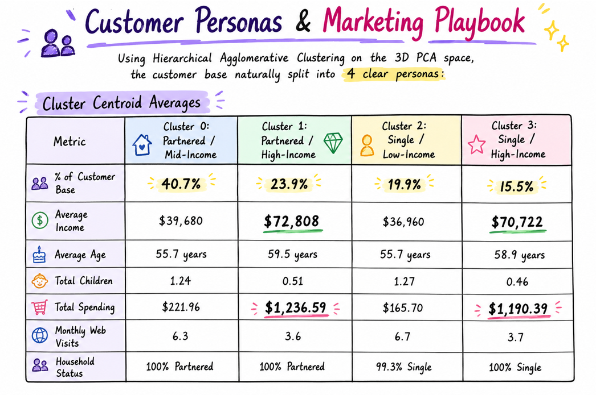

# 🛒 SmartCart: E-Commerce Customer Segmentation with Machine Learning

[](https://www.python.org/)
[](https://scikit-learn.org/)
[](https://pandas.pydata.org/)
[](https://opensource.org/licenses/MIT)

An unsupervised machine learning project I built to group e-commerce customers based on their demographics, spending habits, and shopping behaviors. By applying PCA to simplify the data, and using K-Means and Hierarchical Clustering, I segmented the customer base into **4 distinct personas**. This helps marketing teams run highly targeted campaigns instead of blasting the same generic email to everyone on their list.

---

## 🔍 The Pipeline & Clustering Workflow

The project follows a standard unsupervised learning workflow, from initial data cleaning to final persona profiling:



### Behind the Scenes: How the Pipeline is Built

To extract clean customer archetypes from raw behavioral data, I designed and built a structured preprocessing pipeline:

* **Handling missing entries**: I filled any missing entries in the `Income` column using the median to prevent high-income skewness from biasing the cluster boundaries.
* **Engineering behavioral features**: To extract stronger signals of buyer intent, I combined individual item categories (wines, fruits, meats, fish, sweets, and gold) into a single `Total_Spending` feature, and combined household kids and teens into a single `Total_Children` metric. I also converted raw registration dates into a relative `Customer_Tenure_Days` metric and calculated customer ages relative to the benchmark year (2026).
* **Cleaning up the noise**: I filtered out a few outlier data points (like customers older than 90 or with an annual income over $600k) to keep the clustering boundaries statistically clean, leaving me with a high-signal dataset of **2,236** active customers. I also dropped database keys and redundant columns (like ID, signup dates, and birth years) to clean up the feature set.
* **Encoding & Scaling**: I one-hot encoded categorical demographics (`Education` and `Living_With`). Since distance-based models are highly sensitive to scale, I passed all numerical features through `StandardScaler` to keep everything on an even playing field.
* **Dimensionality Reduction (PCA)**: I compressed the high-dimensional feature space down to **3 principal components**. This captures **44.96%** of the original variance while preventing the "curse of dimensionality" from degrading my distance-based calculations.

---

## 📊 Cluster Evaluation & Results

To find the optimal number of segments, I evaluated K-Means across a range of $K$ (1 to 10) using **Within-Cluster Sum of Squares (WCSS)** and the **Silhouette Coefficient**:

### Finding the Optimal K (WCSS vs. Silhouette Scores)

| Clusters ($K$) | WCSS (Inertia) | Silhouette Score |
| :---: | :---: | :---: |
| 1 | 18093.26 | *N/A* |
| 2 | 10760.84 | 0.3716 |
| 3 | 8830.29 | 0.3077 |
| **4 (Selected)** | **6650.97** | **0.3581** |
| 5 | 5006.16 | 0.4000 |
| 6 | 4396.31 | 0.3993 |
| 7 | 3857.63 | 0.4026 |
| 8 | 3207.06 | 0.4051 |
| 9 | 3025.22 | 0.4012 |
| 10 | 2651.44 | 0.4029 |



### 💡 What the numbers tell us
* **Why I selected K=4**: While $K=5$ shows a slightly higher silhouette score, my elbow analysis (which I validated mathematically using the `KneeLocator` package) showed that $K=4$ is the sweet spot. It gives a sharp reduction in WCSS (**6650.97**) and yields highly distinct, interpretable customer groups that marketing teams can easily target.
* **How the PCA components behave**:
  * **PC1 (23.16% variance)** is mostly driven by customer spending power and purchase frequency.
  * **PC2 (11.39% variance)** is dominated by family size and household demographics.
  * **PC3 (10.41% variance)** captures customer tenure and specific product interests.
  Together, they let me compress **44.96%** of the total variance into a clean 3D space, making visualization and grouping much more effective.

### ⚠️ Why Other Clustering Algorithms Were Excluded

To ensure the best possible marketing segmentation, I evaluated other popular clustering techniques but excluded them due to specific architectural and business limitations:

* **DBSCAN (Density-Based Clustering)**: While great at handling noise and arbitrary shapes, DBSCAN struggles with clusters of varying densities. For customer profiles—where some personas are tightly grouped (e.g., budget-conscious families) and others are sparsely distributed—DBSCAN often struggles to find a single epsilon ($\epsilon$) parameter, either merging distinct groups or labeling too many valid customers as "noise" (outliers) that marketing cannot target.
* **Gaussian Mixture Models (GMM)**: GMMs perform soft clustering by assuming data points are generated from a mixture of Gaussian distributions. However, they are highly sensitive to initialization, computationally expensive, and can easily overfit or fail to converge on smaller datasets with high-dimensional feature boundaries.
* **Spectral Clustering**: This method maps data to a lower-dimensional space using graph theory. It has a high computational complexity of $O(N^3)$, making it highly unscalable for larger customer databases, and its output clusters are notoriously difficult to interpret for business/marketing applications compared to centroid-based clusters.
* **Agglomerative Hierarchical Clustering (as a standalone primary algorithm)**: While useful for visualizing sub-clusters (dendrograms) and profiling centroids, it suffers from $O(N^2 \log N)$ time and $O(N^2)$ space complexity. It lacks the mathematical efficiency of K-Means for larger customer bases and cannot re-assign points once they are grouped in a hierarchy level.

### 📊 3D Cluster Visualizations

To compare the boundaries generated by the two primary candidate algorithms, I projected the 4 clusters into 3D PCA space:

| K-Means Clustering | Agglomerative Hierarchical Clustering |
| :---: | :---: |
|  |  |

---

## 👥 Customer Personas & Marketing Playbook

Using Hierarchical Agglomerative Clustering on the 3D PCA space, the customer base naturally split into 4 clear personas:



### Actionable Strategies

````carousel
#### 👨‍👩‍👧‍👦 Cluster 0: Partnered / Mid-Income Families (40.7% of customers)
This segment represents couples with multiple kids at home. They have moderate household incomes, visit the web store frequently, but keep their average spending low per visit. The best way to engage them is through value-driven marketing: promote family bundle deals, seasonal discounts (such as back-to-school), and loyalty programs that incentivize converting their frequent browsing into purchases.
<!-- slide -->
#### 💎 Cluster 1: High-Income Couples (23.9% of customers)
These are partnered households with few or no children at home. They represent our highest income group and are the biggest spenders, buying heavily from physical stores and catalogs. Because they value quality and convenience over discounts, we should target them with a premium VIP loyalty tier, market premium items like wine and gold products directly, and offer concierge services or exclusive early access previews.
<!-- slide -->
#### 🙋‍♂️ Cluster 2: Single Budget Shoppers (19.9% of customers)
This segment is made up of single-parent or solo households with lower incomes. They spend the least per visit but have the highest web visit rates. To lower their cart abandonment rates, we should use retargeting ads highlighting budget-friendly entry products, free shipping codes, or flexible checkout options like 'Buy Now, Pay Later'.
<!-- slide -->
#### 🕶️ Cluster 3: Affluent Singles (15.5% of customers)
These are solo buyers with high disposable incomes, few/no kids, and very high spending. Notably, they show the highest conversion rate on marketing campaigns. To capture their attention, we should use direct digital channels with personalized email recommendations, digital flash sales, and targeted social media ads for high-end or trending items.
````

---

## 🚀 Next Steps: How I'd Take This Further

If I had more time or were preparing this for a production launch, here are the 5 things I'd tackle next to boost performance:

1. **Transition to Soft Clustering with GMMs**: K-Means enforces hard boundaries, forcing every customer into a single cluster. I'd implement a **Gaussian Mixture Model (GMM)** to assign membership probabilities, giving a much more realistic picture of overlapping customer habits.
2. **Leverage Density-Based Clustering (DBSCAN)**: Instead of setting manual outlier thresholds (like age < 90), I'd use **DBSCAN** or **HDBSCAN** to automatically treat low-density noise points as outliers, making the boundaries cleaner and more statistically sound.
3. **Explore Non-Linear Projection (UMAP)**: Since PCA is a linear projection and might miss complex, non-linear relationships, I'd try switching to **UMAP** to preserve local structures and potentially yield clearer separations.
4. **Build a Unified Scikit-Learn Pipeline**: I want to wrap the entire preprocessing, scaling, and PCA steps into a single `Pipeline` or `ColumnTransformer` to prevent data leakage and make deployment easier.
5. **Develop an Interactive Dashboard**: I'd build a simple interactive dashboard using **Streamlit** or **Gradio** so that marketing managers can adjust sliders for age, income, and spending, and instantly visualize where a customer fits and what products to recommend.

---

## 🛠️ How to Run the Project Locally

Follow this quick-start guide to run the notebook on your local machine:

### 1. Clone and Navigate
```bash
git clone <repository-url>
cd SmartCart_E-Commerce--A_Customer_Segmentation_System
```

### 2. Spin Up a Virtual Environment

* **On Windows (PowerShell):**
  ```powershell
  python -m venv .venv
  .venv\Scripts\Activate.ps1
  ```
* **On macOS/Linux:**
  ```bash
  python3 -m venv .venv
  source .venv/bin/activate
  ```

### 3. Install the Packages
```bash
pip install -r requirements.txt
```
*(Note: If you run into issues, the core dependencies are `pandas`, `numpy`, `matplotlib`, `seaborn`, `scikit-learn`, `kneed`, and `jupyter`.)*

### 4. Select the Jupyter Kernel
1. Open the project folder in VS Code.
2. Open [SmartCart_Clustering_System.ipynb](SmartCart_Clustering_System.ipynb).
3. In the top-right corner, click on the **Kernel Selector** -> **Python Environments**.
4. Select the interpreter inside your `.venv` directory (e.g., `.venv/Scripts/python.exe` on Windows).

### 5. Running the Notebook
To run all cells and update the notebook in-place:
```bash
jupyter nbconvert --to notebook --execute --inplace SmartCart_Clustering_System.ipynb
```
Or open it interactively:
```bash
jupyter notebook
```